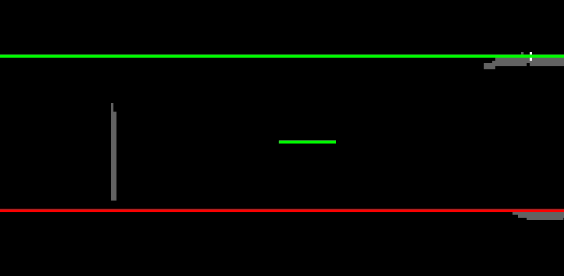

# ROS-lane-detection

This repository contains a Python algorithm implemented in ROS that listens/subscribes to the global costmap of a robot, processes it as an image in real-time using OpenCV, detects edges in the image, and generates 2 lines either side of the robot through post-processing of the HoughLines function output and TF-handling.

The repository contains a ROS bag file whose global costmap was generated using 2 RealSense Depth Cameras, one at the front of the robot and the other at its back, with the robot placed between two lanes. The output of the bag file can be seen in the GIF below, where the long red and green lines represent the detected lanes, the small and stationay red line represents the orgin of the map, and the short and moving green line represents the robot and its orientation.

To run the code, first run the bag file, and on a different command window do a rosrun of the lane_detection.py
The action folder and message integrates with a parallel project that makes use of the lane detection to control the robot motion through PID controls - not listed here.
